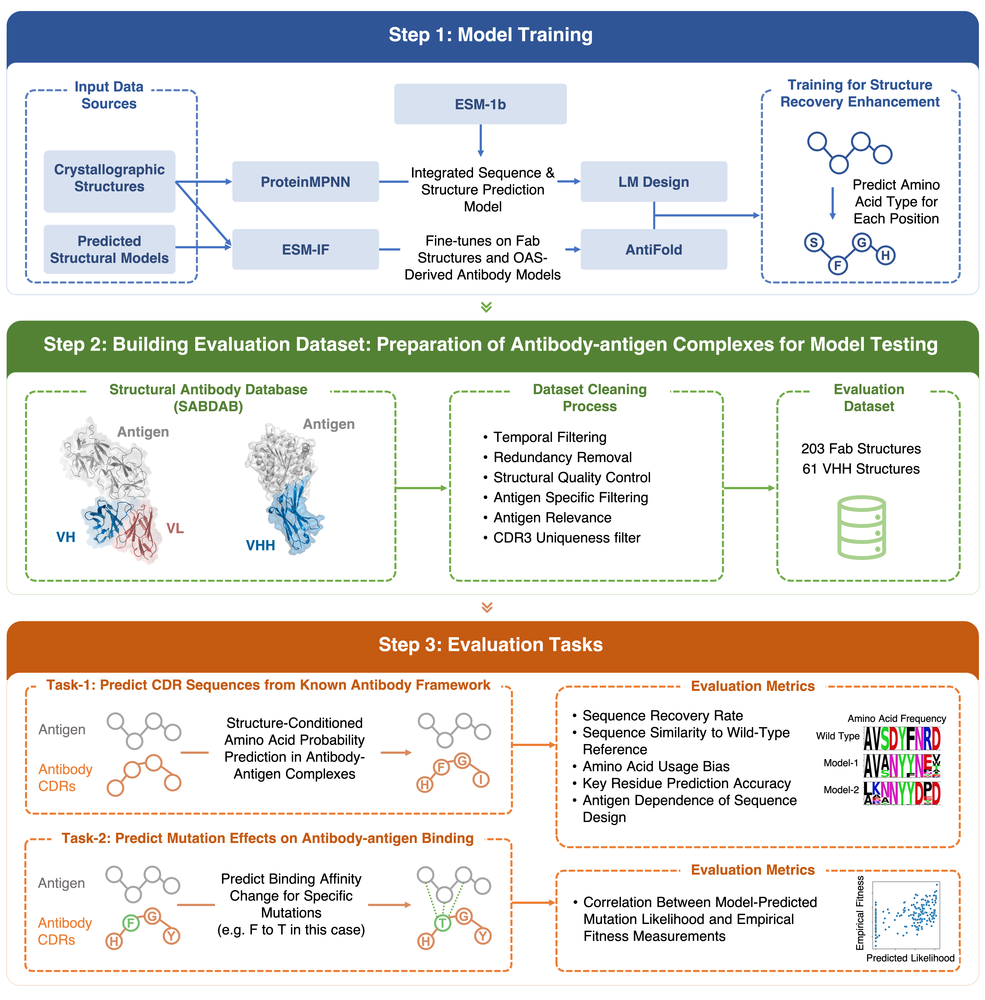

# InverseFoldingEvaluation
Benchmarking Inverse Folding Models for Antibody CDR Sequence Design




## Overview
This repository provides the complete benchmark framework and analysis pipeline for evaluating state-of-the-art inverse folding models on antibody CDR sequence design tasks.

We systematically evaluated AntiFold, ProteinMPNN, ESM-IF, and LM-Design on multiple tasks:
 - Antibody CDR sequence design
 - Mutation effect prediction

For Antibody CDR sequence design, we evaluated the performance with metrics including:
 - Sequence Recovery Rate
 - Sequence Similarity to Wild-Type Reference
 - Amino Acid Usage Bias
 - Key Residue Prediction Accuracy
 - Antigen Dependence of Sequence Design

The study and results are described in detail in our manuscript:

Yifan Li, et al. Benchmarking Inverse Folding Models for Antibody CDR Sequence Design, PLOS ONE, 2025.

## Repository Structure

```bash
InverseFoldingEvaluation/
│
├── AntiFold/                    # AntiFold source code and scripts
├── ProteinMPNN/                 # ProteinMPNN source code and scripts
├── esm-if/                      # ESM-IF source code and scripts
├── ByProt/                    # LM-Design source code and scripts
│
├── InverseFoldingDesign/        # Benchmark input data and inference scripts
│   ├── pdbs/                    # PDB structures used for benchmark
│   ├── run_antifold.sh          # AntiFold inference script
│   ├── run_proteinmpnn.sh       # ProteinMPNN inference script
│   ├── run_lmdesign.sh          # LM-Design inference script
│   ├── run_esmif.sh             # ESM-IF inference script
│
└── Analysis/                    # Data analysis and visualization
    ├── data/
    │   ├── raw/                 # Original sequence designs from each model
    │   │   ├── pdbs/
    │   │   └── designs/
    │   ├── processed/           # Processed data, annotation tables
    │   ├── resources/           # BLOSUM62 and other auxiliary matrices
    │   └── metadata.json        # Benchmark metadata and experimental settings
    │
    ├── scripts/                 # Data processing, scoring and utility scripts
    │   ├── data_processing.py
    │   ├── calculate_metrics.py
    │   └── ...
    │
    ├── notebooks/               # Analysis notebooks
    │   ├── seq_design_analysis.ipynb       # Sequence design benchmark analysis
    │   └── mutation_effect_analysis.ipynb  # Mutation effect prediction correlation
    │
    ├── results/                 # Figures and tables used in the manuscript
    │   ├── figures/
    │   ├── tables/
    │   └── benchmark_summary.csv
    │
    └── requirements.txt         # Required Python packages
```

## Features
 - Full reproduction of sequence design and mutation effect prediction benchmarks
 - Includes all input PDBs, model-specific design outputs, and metadata
 - Modular data processing pipeline
 - Visualization of recovery rates, sequence similarity, amino acid distributions, and mutation prediction correlations
 - Consistent with PLOS ONE data sharing and reproducibility guidelines


## Installation

### dependencies for analysis codes
```bash
Clone this repository
git clone https://github.com/biomap-research/InverseFoldingEvaluation.git
cd InverseFoldingEvaluation

# Install Python dependencies for analysis
pip install -r ./Analysis/requirements.txt
```

### dependencies for inverse folding models

|Model name| Command |
| --- |  --- |
|Antifold|`conda create env -f Antifold/environment.yml`|
|ByProt|`conda create env -f ByProt/env.yml`|
|ProteinMPNN|`conda install pytorch torchvision torchaudio cudatoolkit=11.3 -c pytorch`|
|esm-if | `conda create env -f esm-if/environment.yml`|


## Usage Workflow
1. Run Inverse Folding Models
Example (AntiFold):

```bash
# activate conda env for Antifold first
cd InverseFoldingDesign
bash run_antifold.sh
```

2. Process Raw Designs
Example:
```python
from scripts.data_processing import *
```

3. Run Analysis Notebooks
 - seq_design_analysis.ipynb: evaluates sequence recovery, similarity, composition
 - mutation_effect_analysis.ipynb: evaluates mutation prediction correlation


## License
This project is licensed under the MIT License.

## Citation
If you use this code or dataset in your work, please cite:

Li, Y., et al. Benchmarking Inverse Folding Models for Antibody CDR Sequence Design, PLOS ONE, 2025.
